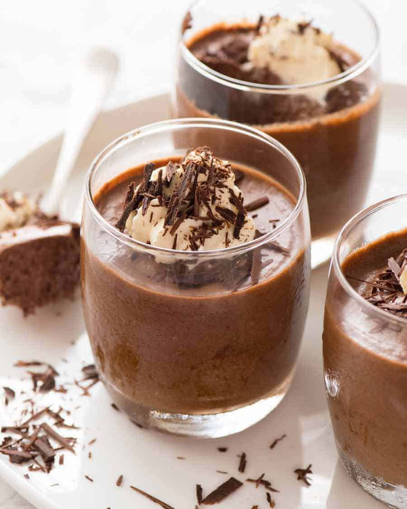

This is a classic chocolate mousse **made the proper French way,** as served in **fine dining restaurants**. Less cream, more chocolate, a more intense chocolate flavour and a beautiful creamy mouth feel.

## Ingredients

* 3 eggs (~55g/2 oz each)
* 125g / 4.5 oz dark cooking chocolate , bittersweet / 70% cocoa 
* 10g / 0.3 oz unsalted butter
* 125 ml cream , full fat 
* 35 g caster sugar (superfine white sugar)

### Decorations:

* More whipped cream
* Chocolate shavings 

## **Method**

1. For reliable results, work at a steady pace so your whipped egg whites and cream do not get too warm!
2. **Separate eggs and yolks** while eggs are cold. Place whites in a large bowl and yolks in a small bowl. Leave whites while you prepare other ingredients. 
3. **Yolks:** Whisk yolks until uniform.
4. **Melt chocolate and butter:** Break chocolate into pieces and place in a microwave-proof bowl with the butter. Melt in the microwave in 30 second bursts, stirring in between, until smooth. Set aside to cool slightly while you proceed with other steps.
5. **Whip cream:** Beat cream until stiff peaks form, being careful not to over-whip (see video).
6. **Whip whites:** Add sugar. Beat whites until firm peaks form.

### Fold together all ingredients:

1. Fold egg yolks into cream using a rubber spatula – 8 folds max. Some streaks is fine.
2. **Check chocolate temperature:** The chocolate should still be runny but warm (min 35C / 95F; ideal 40C / 104F). If too cool or thick, microwave in burst of 5 seconds at a time until runny.
3. Pour chocolate into cream yolk mixture. Fold through – 8 folds max. Some streaks here are ok.
4. Add 1/4 of beaten egg whites into chocolate mixture. Fold through until incorporated – "smear" the spatular across surface to blend white lumps in – aim for 10 folds. 
5. Pour chocolate mixture into egg whites. Fold through until incorporated and no more white lumps remain – aim for 12 folds max, but ensure there are no obvious egg white patches.
6. Divide mixture between 4 small glasses or pots. Refrigerate for at least 6 hours, preferably overnight.
7. To serve, garnish with cream and chocolate shavings. Raspberries and a tiny sprig of mint for colour would also be lovely!

<iframe width="560" height="315" src="https://www.youtube.com/embed/YO74CgACqEY?rel=0" allow="accelerometer; autoplay; encrypted-media; gyroscope; picture-in-picture" allowfullscreen></iframe>
