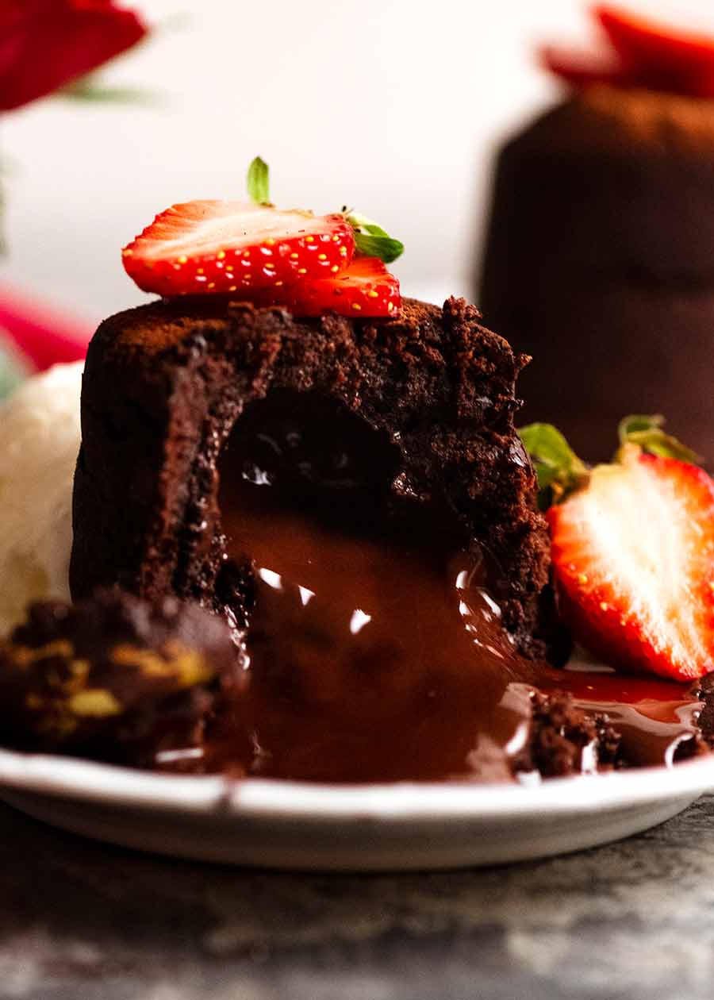

Molten Chocolate Cakes, also known as Lava Cakes, are warm individual-size chocolate cakes with oozing chocolate centres.

## Ingredients

#### Molten chocolate ganache center:

* 100 g dark chocolate chips or melts/ semi sweet chocolate chips 
* 60 ml cream , heavy/thickened

#### Cake batter:

* 200 g dark chocolate chips or melts/ semi sweet chocolate chips 
* 100g / 7 tbsp unsalted butter , cut into 1cm / ½" cubes
* 2 eggs , at room temperature
* 2 egg yolks , at room temperature
* 110 g caster/superfine sugar (sub ordinary white sugar)
* 2 tbsp flour , plain / all purpose

#### To serve:

* Ice-cream or cream (highly recommended!)
* Cocoa or icing sugar / powdered sugar , for dusting
* Strawberries , raspberries or edible flowers, optional decoration

## Method

#### Molten chocolate ganache:

1. Place chocolate and cream in a microwave-proof bowl. Microwave on high for three 20-second bursts, stirring in between, until chocolate is melted and smooth.
2. Let cool on the counter for 10 minutes, then refrigerate for 3 hours or until firm enough to scoop into balls. (Note 3)

#### Cake:

1. **Preheat oven** to 200°C / 390°F (180°C fan).
2. **Grease & dust moulds:** Grease 4 x 170ml / 5.75oz dariole or pudding moulds with butter then dust insides with cocoa powder, tapping out excess. (Note 4)
3. **Melt chocolate and butter:** Place chocolate and butter in a bowl. Microwave in 30 second bursts, stirring in between. Stir well until smooth, then leave to cool for 5 minutes.
4. **Whisk eggs and sugar:** In a separate bowl, whisk together the eggs, egg yolks and sugar.
5. **Combine with chocolate:** Add the melted chocolate into the eggs, and mix until combined.
6. **Fold through flour:** Add flour and fold through until just combined. Do not over-mix.
7. **Fill moulds:** Pour or scoop the batter into prepared moulds until it reaches ⅓ of the way up.
8. **Drop in ganache:** Place one generously-heaped teaspoon of ganache into middle of batter. Top with more batter until it reaches 1.5cm / ⅗" from the top rim. Repeat for remaining moulds.
9. **Bake 20 minutes:** Place the moulds on an oven tray and bake for 20 minutes, or until the pudding tops spring back when gently touched.
10. **Turn out:** Stand for 2 minutes, then turn onto plate. Tap base then gently remove each mould.
11. **Serve** with ice-cream or cream, dusted with cocoa powder. Decorate with strawberries!

<iframe width="560" height="315" src="https://www.youtube.com/embed/s5fQEm4jS3c?rel=0" allow="accelerometer; autoplay; encrypted-media; gyroscope; picture-in-picture" allowfullscreen></iframe>
