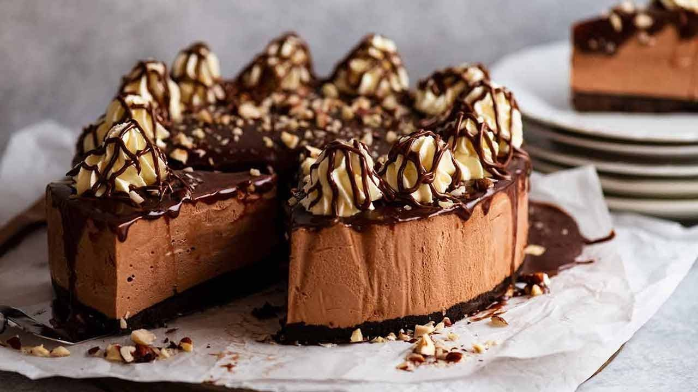

What’s the best way to inject the distinctive choc-hazelnut flavour of Nutella into a Nutella Cheesecake? Make it NO-BAKE. It’s the secret to preserving the Nutella flavour. Of course, a triple punch of Nutella also helps here: in the mousse-y cream cheese filling, the ganache topping and a good melty drizzle of the stuff to finish it off!

## Ingredients

### Base:

* 200g/ 7oz Oreo cookies (1.5 standard packs)
* 60g / 4 tbsp unsalted butter , melted

### Nutella Mousse Filling:

* 3 tsp gelatine powder 
* 60 ml water
* 500g / 1 lb cream cheese , softened
* 60 g soft icing sugar / powdered sugar
* 320 g Nutella 
* 250 ml heavy/thickened cream

### Nutella Ganache Topping:

* 125 ml heavy/thickened cream
* 160 g Nutella
* 50 g dark chocolate chips/semi-sweet chocolate chips

### Toppings:

* 30 g hazelnuts , lightly toasted then chopped
* 125 ml heavy/thickened cream (for whipping)
* 3 tbsp Nutella , warmed

## Method

1. **Prepare pan:** Flip the base of a 20cm / 8" springform pan upside down – this makes it easier to remove the finished cheesecake without the lip in the way. Butter pan base, then press on a square sheet of baking paper. Clip the pan sides onto the base, letting the excess paper overhang. Butter and line the pan sides with more baking paper.

### Oreo Biscuit Base:

1. **Blitz cookies:** Roughly break up Oreos with hands and place in food processor. Blitz until they become fine crumbs. Add melted butter, then blitz again until combined.
2. **Press into pan:** Transfer crumbs into prepared pan, pressing evenly and firmly on to the base (I use the underside of a straight-sided, flat-bottomed cup measure to do this).

### Nutella Mousse Filling:

1. **Bloom gelatine:** Place water in a small bowl then sprinkle the gelatine powder across the surface. Stir to partly dissolve. Set aside 5 minutes. It will turn thick; this process is called blooming. Microwave the gelatine for 15 seconds to turn it into liquid, stir, then let it stand for 5 minutes to cool.
2. **Cream cheese and Nutella mixture:** Beat cream cheese, Nutella and icing sugar until smooth. Add the cooled gelatine liquid and beat another 30 seconds.
3. **Whip cream:** In a separate bowl, whip the cream until stiff peaks form.
4. **Fold in cream:** Add one third of the whipped cream to the Nutella mixture and gently fold until just combined. Fold in another third of the cream the same way. Then fold in the remaining cream.
5. **Transfer to cake pan:** Pour the mixture into the prepared tin and place back in the fridge for at least 1 hour to set.

## Decorating

1. **Nutella ganache:** Place cream, Nutella and chocolate chips into a heatproof bowl. Microwave in two 30-second bursts, stirring in between, until smooth.
2. **Pour ganache onto cheesecake:** Allow ganache to cool for 5 minutes, then pour over the set cheesecake base. Tilt pan to spread it over the surface evenly.
3. **Refrigerate** cheesecake at least 3 hours before sprinkling with hazelnuts (otherwise they sink into the cake!)
4. **Decorate:** Sprinkle over hazelnuts. Pipe dollops of whipped cream around the edge, then drizzle with warm Nutella. Slice greedy-sized wedges and devour!

<iframe width="560" height="315" src="https://www.youtube.com/embed/https://youtu.be/sX_Q-90Eo3Q?rel=0" allow="accelerometer; autoplay; encrypted-media; gyroscope; picture-in-picture" allowfullscreen></iframe>
