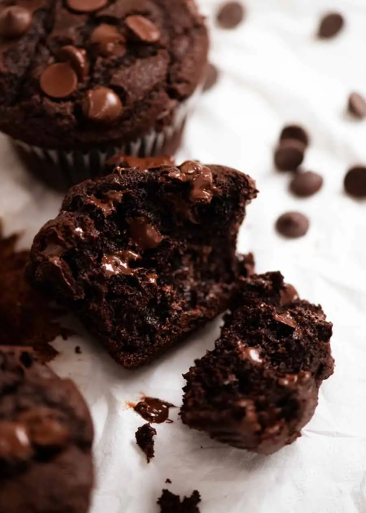

Chocolate muffins are notorious for being dry because of the cocoa powder. But not these!

## Ingredients

* 260 g plain flour (all-purpose flour) 
* 1 1/4 tsp baking soda / bi-carb 
* 1/2 tsp salt
* 60 g Dutch process cocoa powder , sifted 
* 1 tbsp instant coffee granules / powder , optional 
* 185 ml milk , full fat, HOT
* 125 ml canola oil (or veg or other neutral flavoured oil)
* 200 g brown sugar , packed
* 1 tsp vanilla extract
* 200 g sour cream or thick plain yogurt (fridge-cold fine)
* 1 large egg (55-60g / 2oz) (fridge-cold fine)
* 300 g dark chocolate chips 

## Method

1. **Preheat** oven to 210°C / 410°F (190°C fan). Place shelf in the top 1/3 of the oven. Line a 12-hole standard muffin tin with paper cases.
2. **Sift Dry ingredients:** Sift flour, baking soda and salt into a large bowl.
3. **Bloom cocoa:** In a separate bowl, sift the cocoa then add coffee and HOT milk. Whisk until lump-free.
4. **Add remaining Wet ingredients:** To the cocoa mixture, add sugar, oil, egg, sour cream and vanilla. Whisk until smooth.
5. **Mix flour in:** Pour Wet mix into the bowl holding the flour. Whisk until smooth and glossy. Stop once it's smooth, don't mix excessively. (Note 7)
6. **Add chocolate chips:** Stir in most of the chocolate chips – reserve approx 1/4 cup for topping.
7. **Fill muffin tin:** Divide the batter between the 12 holes, up to 0.5cm / 0.2" from rim of paper liner. (Note 8)
8. **Top with chocolate chips:** Top muffins with reserved chocolate chips (just pile in middle, they spread when baked).
9. **Bake at high temp, 5 minutes:** Bake for 5 minutes in preheated oven. The higher temp kick will start the rise.
10. **Lower oven, 20 minutes:** Turn oven DOWN to 190°C / 375°F (170°C fan). Bake a further 20 minutes, checking at 15 minutes. When toothpick comes out clean they're ready. Don't confuse melted chocolate with raw batter!
11. **EAT!** Rest in muffin tin for a few minutes, then transfer to cooling rack. Allow to cool for 15 minutes before devouring!

<iframe width="560" height="315" src="https://www.youtube.com/embed/https://youtu.be/xmOoFwRtLa0?rel=0" allow="accelerometer; autoplay; encrypted-media; gyroscope; picture-in-picture" allowfullscreen></iframe>
