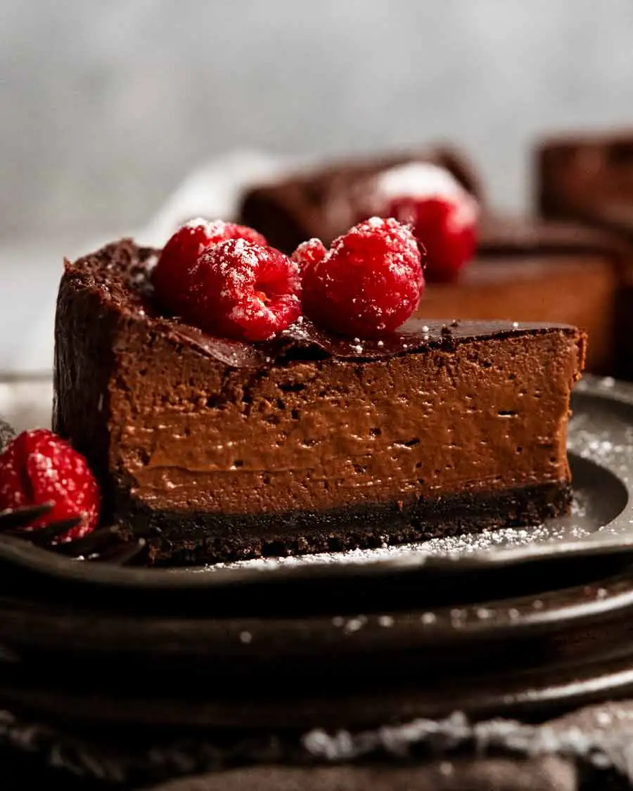

It’s as chocolatey and creamy as it looks. You can cut it into neat slices (like… cake!). But when you eat it, it’s gloriously creamy. It’s luxurious, with a rich mouthfeel. It is a real custard, after all, nothing like the fake stuff sold in cartons at the store which is a sad imitation of the real deal. But this is not overly rich and definitely not overly sweet. Decadent enough for special occasions, easy enough to make for a morning tea at work. 

## Ingredients

### Base:

* 200g/ 7oz Oreo cookies (1.5 standard packs)
* 60g/ 4 tbsp unsalted butter , melted

### Custard:

* 750 ml milk , full fat
* 2 tsp vanilla
* 130 g caster sugar (superfine sugar, sub regular)
* 120g/ 4.2 oz egg yolks (~6 – 7 large eggs)
* 50 g cornflour / cornstarch
* 200g / 7 oz 70% cocoa chocolate , finely chopped (I use Lindt)

### For Serving (optional):

* Chantilly Cream
* Raspberry or strawberries
* Icing sugar / powdered sugar, for dusting

## Method

### Preperation:

1. **Prepare pan**: Flip the base of a 20cm / 8" springform pan upside down – this makes it easier to remove the finished cake without the lip in the way. Grease pan base with butter, then press on a square sheet of baking paper. Clip the pan sides onto the base, letting the excess paper stick out (ease of removal later).
2. **Preheat oven** to 180°C / 350°F (160°C fan-forced).

### Custard:

1. **Heat the milk,** vanillaand about half the sugar in a large saucepan over medium high heat until just before boiling, stirring to dissolve the sugar.
2. **Yolk mixture:** Place egg yolks and remaining sugar in a large bowl and whisk to combine. Add cornflour and whisk until smooth.
3. **Temper eggs:** While whisking the eggs, slowly pour in the hot milk in a thin stream while whisking. Whisk until fully combined.
4. **Thicken custard:** Pour the egg-milk mixture back into the same saucepan. Place over medium low heat, stirring constantly so the base doesn't catch, until it starts to thicken (you will feel it). It should happen within 3 to 5 minutes. If it gets lumpy, remove off heat, whisk vigorously – will become smooth.
5. **Stir 45 sec after bubbles:** When the custard is thickened and steamy, and you see the first big lazy bubbles appear on the base (pause whisking to see), whisk constantly on the stove for a further 45 seconds then remove from stove.
6. **Add chocolate** and stir until fully melted.
7. **Cool:** Transfer into a bowl, immediately cover with cling wrap touching the surface. (You can strain if you're concerned about lumps). Set aside while preparing the base.

### Biscuit Base:

1. **Blitz cookies:** Roughly break up Oreos with hands and place in food processor. Blitz until they become fine crumbs. Add melted butter, then blitz again until combined.
2. **Press:** Transfer crumbs into prepared pan, pressing evenly and firmly on to the base (I use the underside of a straight-sided, flat-bottomed cup measure to do this).

### Bake:

1. **Bake 1 hour:** Whisk custard until smooth to loosen. Pour onto the base, smooth surface. Bake 60 minutes, rotating the cake pan at the 45 minute mark. *It will still be wobbly when you pull it out of the oven.*
2. **Cool** for 3 hours on the counter, in the pan. Refrigerate at least 12 hours to allow the custard to fully set.
3. **Serve:** Best to cut when fridge cold and serve at room temp (for creamiest custard!). Remove springform sides and paper, then use paper overhang to slide the cake off the base. Cut like cake and serve! Lovely with dollop of Chantilly Cream [Chantilly cream](https://www.recipetineats.com/chantilly-cream-lightly-sweetened-whipped-cream/) and a raspberry or strawberry. Dust with icing sugar to make it pretty!

<iframe width="560" height="315" src="https://www.youtube.com/embed/https://youtu.be/m-ghbf0FlEk?rel=0" allow="accelerometer; autoplay; encrypted-media; gyroscope; picture-in-picture" allowfullscreen></iframe>
